[TOC]


# 前言

railgun工具插件开发依赖库，由于go是编译语言，所以要实现动态代码执行，需要提前解析依赖；

我单独分离了依赖库，可用于插件编写，请提前具备go语言的基础。

目前支持poc/exp的编写。


# 编写模板

https://github.com/lz520520/railgun-plugin-demo


# exp编写规范

## exp文件创建

根目录为`modules/exps/exp_plugins`，往下每个产品单独目录，目录名以`exp_`开头，每个目录下存在每个产品对应的各种漏洞exp的go文件，文件也是以`exp_`开头

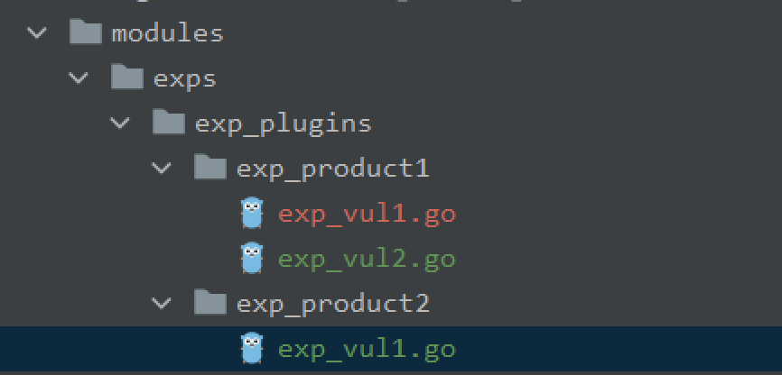


## exp编写

### 导入依赖库

```go
import (
	"github.com/lz520520/railgunlib/pkg/templates/exp_templates"
	"github.com/lz520520/railgunlib/pkg/register/exp_register"
	"github.com/lz520520/railgunlib/pkg/templates/exp_model"
)
```


### exp结构体

声明一个exp结构体，结构体名严格按照`Exp_`开头，一定要首字母大写，结构体内只需要继承`exp_templates.ExpTemplate`即可

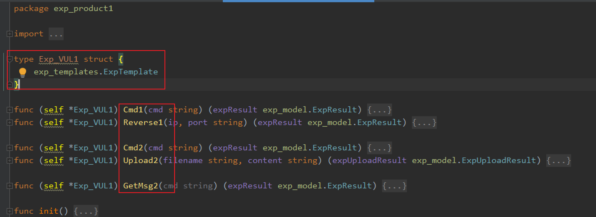

接着就是exp的利用方法，因为一个漏洞可能有多种利用方式，并且可能会有多种不同payload，所以会如上图形成各种利用方法。

这里类型分为GetMsg/Cmd/Reverse/Upload四种，后跟payload的序号数字，一定要严格按照这个，否则无法解析。

方法签名如下

```go
func (self *exp) GetMsg1(cmd string) (expResult exp_model.ExpResult)
func (self *exp) Cmd1(cmd string) (expResult exp_model.ExpResult)
func (self *exp) Reverse1(ip, port string) (expResult exp_model.ExpResult)
func (self *exp) Upload1(filename string, content string) (expUploadResult exp_model.ExpUploadResult)
```

PS: 返回值均为结构体，详细说明可直接查看代码注释


### 编写exp举例


如一个S2-045，代码如下

```go
func (self *Exp_VUL1) Cmd2(cmd string) (expResult exp_model.ExpResult) {
	// 获取请求头配置
	headers := self.GetInitExpHeaders()

	// 构造payload，头部插入payload
	shellPayload := `%{...}`
	shellPayload = strings.Replace(shellPayload, "lz520520", cmd, 1)
	headers.Set("Content-Type", shellPayload)

	// 发送请求
	httpresp := self.HttpGet(self.Params.Target, headers)
	if httpresp.Err != nil {
		expResult.Err = httpresp.Err
		return
	}
	expResult.Result = httpresp.Body
	return

}
```


由于结构体继承了`exp_templates.ExpTemplate`,可以使用父类的方法来处理（PS：这里只是引用了其他语言里基于对象的说法，go里没有对象）

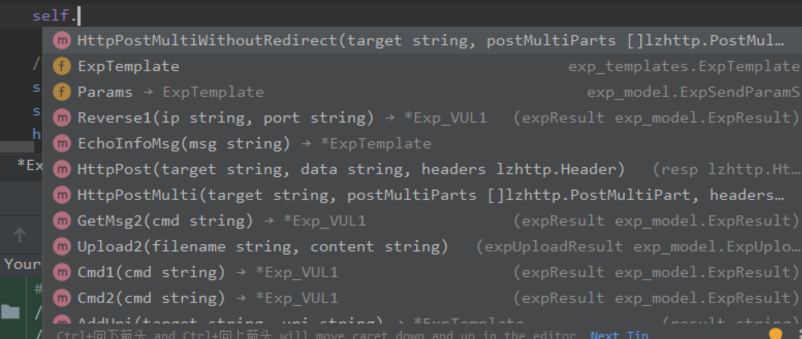

self.Params里有需要的各种请求参数。

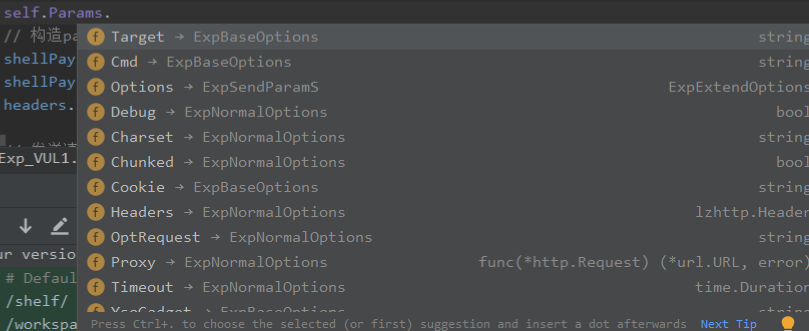


### 打印结果

打印结果有两种方法，将结果如下保存到相应结构体里即可

```
expResult.Result = httpresp.Body
```


或者调用logTpl.go里的方法打印也可。

```go
// 调试信息打印，开启DEBUG方可显示
func (self *ExpTemplate) EchoDebugMsg(msg string) {}
// 信息打印
func (self *ExpTemplate) EchoInfoMsg(msg string) {}
// 不换行信息打印
func (self *ExpTemplate) EchoInfoMsgWithoutReturn(msg string) {}
// 错误信息打印
func (self *ExpTemplate) EchoErrMsg(msg string) {}
// 不换行错误信息打印
func (self *ExpTemplate) EchoErrMsgWithoutReturn(msg string) {}
```


### 漏洞信息注册

漏洞编写完后，除了具体的利用过程，还有一些漏洞信息需要注册的。

编写在init方法内即可，因为go会自动运行init方法。

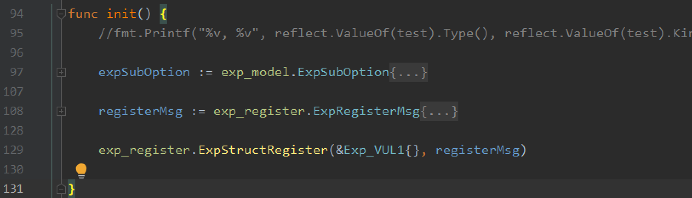

调用`exp_register.ExpStructRegister`传入漏洞结构体的引用，以及注册信息即可。

注册信息分为三部分，漏洞基础信息、子选项扩展，payload别名。（后两个是可选）

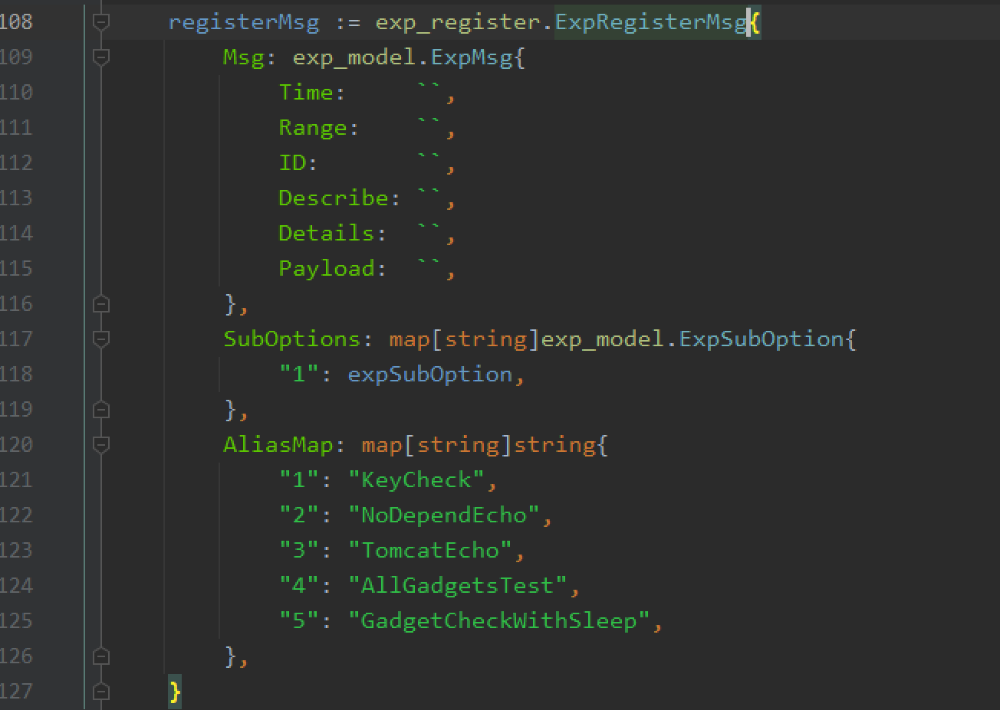


简易的就是如下

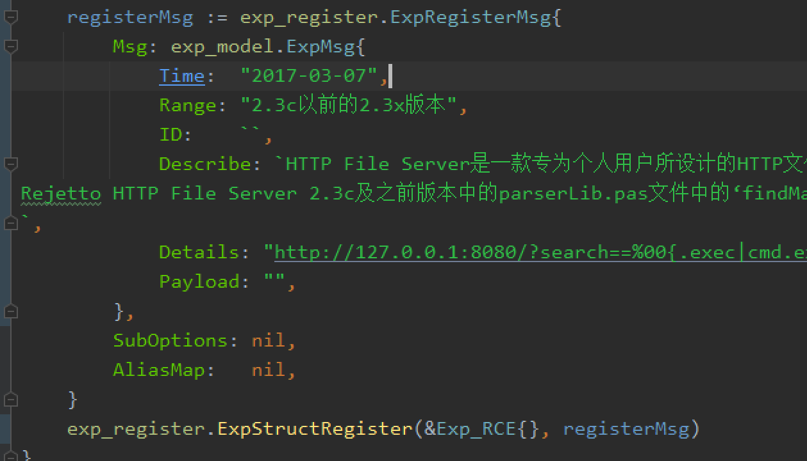


#### 基础信息（必选）

```go
// exp 信息栏
type ExpMsg struct {
	Author   string // 作者信息
	Time     string // 编写时间
	Range    string // 影响范围
	ID       string // CVE等编号
	Describe string // 漏洞描述
	Details  string // 漏洞利用详细说明，每个payload都有一些操作步骤，可在此详细说明。
	Payload  string // 简易payload，用于提示用
}
```

示例

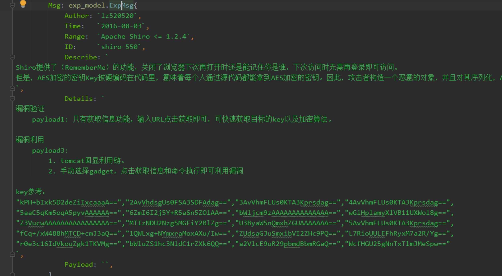

效果


#### 子选项（可选）

上面编写exp时，每个payload都有一个序号，这个可以基于每个payload来指定他所需要设置的子选项，如果key设置成`""`，则表示对所有payload都生效。

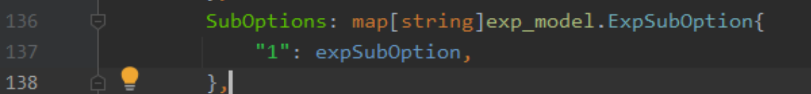

ExpSubOption说明

```go
type ExpSubOption struct {
	CmdContent    string             // cmd默认内容
	CmdSubOptions []ExpSubOptionItem // cmd子选项自绘

	UploadPath       string             // 上传路径默认值
	UploadContent    string             // 上传内容默认值
	UploadSubOptions []ExpSubOptionItem // 上传子选项自绘

	Gadgets []string // gadget选项

	UploadModes []UploadModeType // 上传类型，插件暂时不提供其他选项
}

type ExpSubOptionItem struct {
	StaticText   string      // 标签名称
	Key          string      // 提取选项值所需要的参数
	Value        interface{} // 只有两种类型，string和[]string，分别对应Edit和ComboBox
	DefaultWidth int32       // 默认选项框长度，如果为0，则根据Value长度自适应。
	Position     int         // 位置，只有0/2两个值，因为cmd选项太多，如果需要第二行，则该值设置成2，
}
```

举例

```go
cmdSubOptions := []exp_model.ExpSubOptionItem{
		{
			StaticText:   "前缀: ",
			Key:          "Prefix",
			Value:        "",
			DefaultWidth: 1,
		},
		{
			StaticText: "请求方法: ",
			Key:        "Method",
			Value: []string{
				"GET",
				"POST",
			},
		},
		{
			StaticText: "加密算法: ",
			Key:        "algorithm",
			Value: []string{
				"CBC",
				"GCM",
			},
		},
		{
			StaticText: "Key: ",
			Key:        "key",
			Value:      "kPH+bIxk5D2deZiIxcaaaA==",
		},
		{
			StaticText: "Cookie关键词: ",
			Key:        "rememberMe",
			Value:      "rememberMe",
		},
		{
			StaticText: "Key数量: ",
			Key:        "KeyNum",
			Value: []string{
				"100",
				"1000",
			},
		},
	}
```

效果

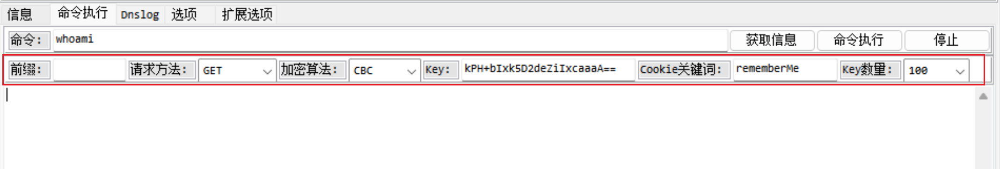


#### 别名（可选）

由于上面编写exp时，每个方法名是固定的，都是以数字编号，如果每个序号需要有别名，可使用别名

```
		AliasMap: map[string]string{
			"1": "KeyCheck",
			"2": "NoDependEcho",
			"3": "TomcatEcho",
			"4": "AllGadgetsTest",
			"5": "GadgetCheckWithSleep",
		},
```

效果

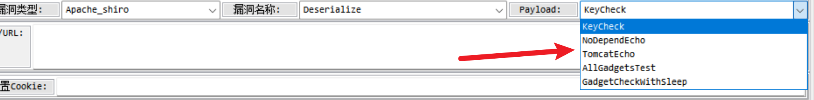


### 最终效果


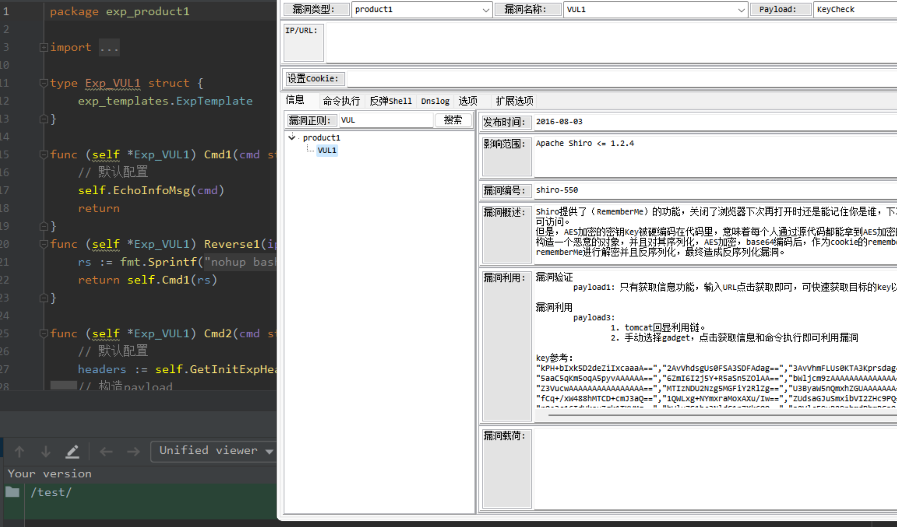

执行效果

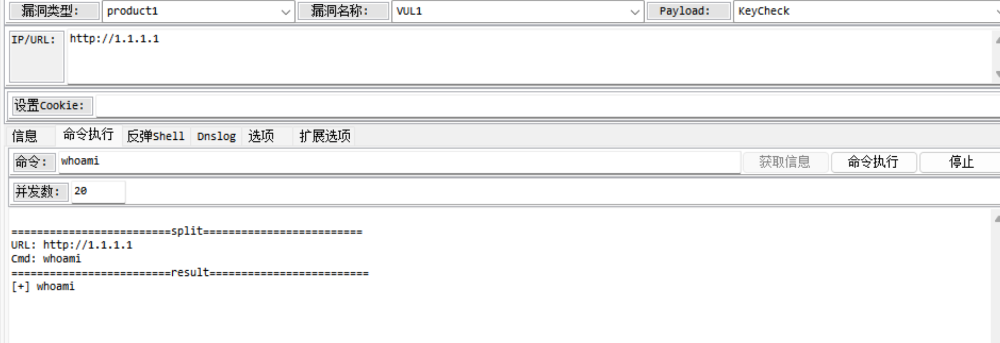


并且如果修改后可右键刷新，实现实时修改调整

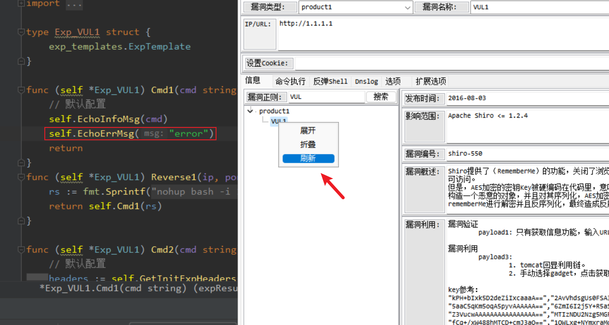


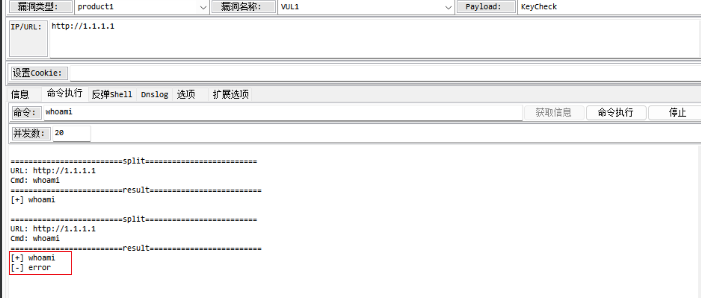


## 常用函数

### HTTP方法

编写方法内部通过接收者的self变量调用即可

```go
// -----------------------HTTP请求----------------------------------
func (self *ExpTemplate) HttpGetWithoutRedirect(target string, headers lzhttp.Header) (resp lzhttp.HttpResp) {
	return
}

func (self *ExpTemplate) HttpPostWithoutRedirect(target, data string, headers lzhttp.Header) (resp lzhttp.HttpResp) {
	return
}

func (self *ExpTemplate) HttpPutWithoutRedirect(target, data string, headers lzhttp.Header) (resp lzhttp.HttpResp) {
	return
}

func (self *ExpTemplate) HttpPostMultiWithoutRedirect(target string, postMultiParts []lzhttp.PostMultiPart, headers lzhttp.Header) (resp lzhttp.HttpResp) {
	return
}
```

注意事项

`HttpPostWithoutRedirect`: 如果header不设置`Content-Type`，默认为`application/x-www-form-urlencoded`


`HttpPostMultiWithoutRedirect`: 这个对应的是`multipart/form-data`，该方法需要传入一个PostMultiPart结构体，如下

```go
	multiParts := []lzhttp.PostMultiPart{
		{
			FieldName:   "filename",
			FileName:    "favicon.png",
			ContentType: "",
			Content:     []byte(content),
		},
	}
```


### 消息打印


```go
// 调试信息打印，开启DEBUG方可显示
func (self *ExpTemplate) EchoDebugMsg(msg string) {}

// 信息打印
func (self *ExpTemplate) EchoInfoMsg(msg string) {}

// 不换行信息打印
func (self *ExpTemplate) EchoInfoMsgWithoutReturn(msg string) {}

// 错误信息打印
func (self *ExpTemplate) EchoErrMsg(msg string) {}

// 不换行错误信息打印
func (self *ExpTemplate) EchoErrMsgWithoutReturn(msg string) {}
```


### 反序列化gadget辅助方法（新增）

```go
// 添加EncodeEcho系列Gadget请求头
func (self *ExpTemplate) AddEncodeCmdHeader(srcheaders lzhttp.Header, cmd string) {
}


// 添加Echo系列Gadget请求头
func (self *ExpTemplate) AddPlainCmdHeader(srcheaders lzhttp.Header, cmd string) {
}

// 检查是否回显利用成功
func (self *ExpTemplate) CheckRespHeader(headers lzhttp.Header) bool {
	return false
}

// 解析EncodeEcho系列响应数据
func (self *ExpTemplate) ParserEncodeCmdResult(rawResult string) (parserResult string, err error) {
	return parserResult, nil
}

// 解析Echo系列响应数据
func (self *ExpTemplate) ParserPlainCmdResult(rawResult string) (parserResult string, err error) {
	return parserResult, nil
}

// 回调延迟利用函数，判断是否存在漏洞
func (self *ExpTemplate) CheckGagdetWithSleep(fun func() error, delay time.Duration) (status bool, err error) {
	return
}

```


### yso利用链（新增）

通过以下函数传入paylod名称以及参数来实现获取yso payload。

```go
func YsoserialPayloadGenerator(payloadType, cmd string) (payload []byte) {
	return
}
```


目前支持的payload

| payload名称                           | 传参举例                       | 备注                     |
| ------------------------------------- | :----------------------------- | ------------------------ |
| URLDNS                                | xxx.dnslog.cn                  | dns解析                  |
| CommonsCollections1                   | calc                           | 无回显                   |
| CommonsCollections2                   | calc                           | 无回显                   |
| CommonsCollections3                   | calc                           | 无回显                   |
| CommonsCollections4                   | calc                           | 无回显                   |
| CommonsCollections5                   | calc                           | 无回显                   |
| CommonsCollections6                   | calc                           | 无回显                   |
| CommonsCollections10                  | calc                           | 无回显                   |
| Jdk7u21                               | calc                           | 无回显                   |
| Jdk8u20                               | calc                           | 无回显                   |
| JRMPClient                            | 192.168.1.1:1099               |                          |
|                                       |                                |                          |
| CommonsBeanutilsNoCC1TomcatEncodeEcho | 调用AddEncodeCmdHeader插入命令 | tomcat编码回显           |
| CommonsBeanutilsNoCC1SpringEncodeEcho | 调用AddEncodeCmdHeader插入命令 | spring编码回显           |
| CommonsBeanutilsNoCC1Sleep            | 空                             | sleep 10秒检测漏洞       |
| CommonsBeanutilsNoCC1SpringEcho       | 调用AddPlainCmdHeader插入命令  | spring明文回显           |
| CommonsBeanutilsNoCC1TomcatEcho       | 调用AddPlainCmdHeader插入命令  | tomcat明文回显           |
| CommonsBeanutilsNoCC1                 | calc                           | 无回显                   |
|                                       |                                |                          |
| CommonsBeanutilsNoCC2TomcatEncodeEcho | 调用AddEncodeCmdHeader插入命令 | tomcat编码回显           |
| CommonsBeanutilsNoCC2Sleep            | 空                             | sleep 10秒检测漏洞       |
| CommonsBeanutilsNoCC2SpringEncodeEcho | 调用AddEncodeCmdHeader插入命令 | spring编码回显           |
| CommonsBeanutilsNoCC2TomcatEcho       | 调用AddPlainCmdHeader插入命令  | tomcat明文回显           |
| CommonsBeanutilsNoCC2SpringEcho       | 调用AddPlainCmdHeader插入命令  | spring明文回显           |
| CommonsBeanutilsNoCC2                 | calc                           | 无回显                   |
|                                       |                                |                          |
| CommonsCollectionsK1TomcatEncodeEcho  | 调用AddEncodeCmdHeader插入命令 | tomcat编码回显           |
| CommonsCollectionsK1TomcatEcho        | 调用AddPlainCmdHeader插入命令  | tomcat明文回显           |
| CommonsCollectionsK1SpringEchoEcho    | 调用AddEncodeCmdHeader插入命令 | spring编码回显           |
| CommonsCollectionsK1SpringEcho        | 调用AddPlainCmdHeader插入命令  | tomcat明文回显           |
| CommonsCollectionsK1Sleep             | 空                             | sleep 10秒检测漏洞       |
| CommonsCollectionsK1                  | calc                           | 无回显                   |
|                                       |                                |                          |
| CommonsCollectionsK2TomcatEncodeEcho  | 调用AddEncodeCmdHeader插入命令 | tomcat编码回显           |
| CommonsCollectionsK2TomcatEcho        | 调用AddPlainCmdHeader插入命令  | tomcat明文回显           |
| CommonsCollectionsK2SpringEchoEcho    | 调用AddEncodeCmdHeader插入命令 | spring编码回显           |
| CommonsCollectionsK2SpringEcho        | 调用AddPlainCmdHeader插入命令  | tomcat明文回显           |
| CommonsCollectionsK2Sleep             | 空                             | sleep 10秒检测漏洞       |
| CommonsCollectionsK2                  | calc                           | 无回显                   |
|                                       |                                |                          |
| FindClassByDNS                        | xxx.dnslog.cn                  | 自动化检测多条利用链依赖 |
|                                       |                                |                          |
|                                       |                                |                          |
|                                       |                                |                          |
|                                       |                                |                          |
|                                       |                                |                          |
|                                       |                                |                          |
|                                       |                                |                          |
|                                       |                                |                          |


### 其他方法


```go
// 获取设置的http头部
func (self *ExpTemplate) GetInitExpHeaders() (headers lzhttp.Header) {
	return
}
// 安全获取map里的value
func (self *ExpTemplate) GetItemSafe(s map[string]string, key string) (ret string) {
	return
}
// 只有当前URL没有路径/目录时，会添加URI
func (self *ExpTemplate) AddUri(target, uri string) (result string) {
	return
}
// 追加URL，基于当前目录
func (self *ExpTemplate) AppendUri(target, uri string) (result string) {
	return
}
// 获取hostname，如192.168.1.1:88
func (self *ExpTemplate) GetHostname(target string) (hostname string) {
	return
}
```


### goutils


```go
// 获得当前程序所在的目录
func GetCurrentProcessFileDir() string {}

// 随机生成 MD5 HASH 值
func RandomMD5Hash() string {}

// 随机生成指定长度的字符串
func RandomHexString(size int) (ret string) {}

// 生成 `UUID` V4 字符串
func UUIDv4() string {}

// 获得当前用户的主目录
func UserHomeDir() string {}

// 是否正确的IP格式
func IsValidIP(ip string) bool {}

// 检测文件是否存在
func FileExists(filename string) bool {}

// 在时间范围内执行系统命令，并且将输出返回（stdout和stderr）
func ExecCmdWithTimeout(timeout time.Duration, arg ...string) ([]byte, error) {}

```


# poc编写规范

## poc文件创建

同exp文件规则。

根目录为`modules/pocs/poc_plugins`，往下每个产品单独目录，目录名以`poc_`开头，每个目录下存在每个产品对应的各种漏洞exp的go文件，文件也是以`poc_`开头

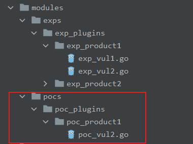


## poc编写

### 导入依赖库

```go
import (
	"github.com/lz520520/railgunlib/pkg/templates/poc_templates"
	"github.com/lz520520/railgunlib/pkg/register/poc_register"
	"github.com/lz520520/railgunlib/pkg/templates/poc_model"
)
```


### poc结构体

声明一个poc结构体，结构体名严格按照`Poc_`开头，一定要首字母大写，结构体内只需要继承`poc_templates.PocTemplate`即可

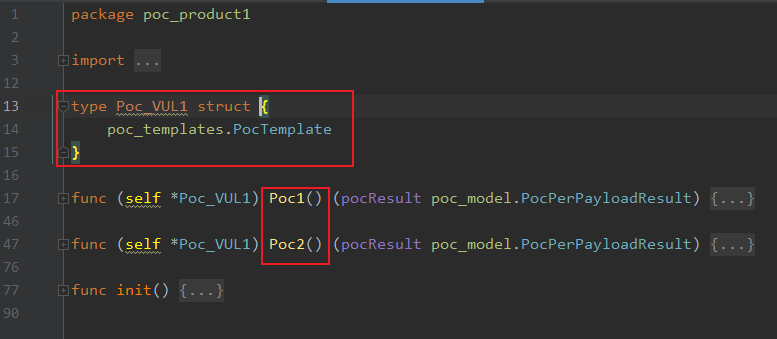


接着就是poc的验证方法，因为一个漏洞可能有多种验证方式，存在不同payload，所以会有多个以`Poc[num]`格式的方法。

方法签名如下，一定要严格按照该命名，否则无法解析。

```go
func (self *Poc) Poc[num]() (pocResult poc_model.PocPerPayloadResult)
```


### 编写poc举例

一个向日葵poc如下

```go
type Poc_SunloginRCE struct {
	poc_templates.PocTemplate
}

type jsonResult struct {
	Code_        int    `json:"__code"`
	Enabled      string `json:"enabled"`
	VerifyString string `json:"verify_string"`
	Code         int    `json:"code"`
}

func (self *Poc_SunloginRCE) Poc1() (pocResult poc_model.PocPerPayloadResult) {
	// 默认配置
	pocResult.Status = false
	headers := self.GetInitPocHeaders()

	resp := self.HttpGet(self.AddUri(self.Params.Target, "/cgi-bin/rpc?action=verify-haras"), headers)
	if resp.Err != nil {
		return
	}
	jr := new(jsonResult)
	err := json.Unmarshal([]byte(resp.Body), jr)
	if err != nil {
		pocResult.Err = err
		return
	}
	if jr.VerifyString != "" {
		pocResult.Status = true
		pocResult.Messages = "CID=" + jr.VerifyString
	}
	//"{\"success\":false,\"msg\":\"Verification failure\"}"

	return
}
```

由于结构体继承了`poc_templates.PocTemplate`,可以使用父类的方法来处理（PS：这里只是引用了其他语言里基于对象的说法，go里没有对象）

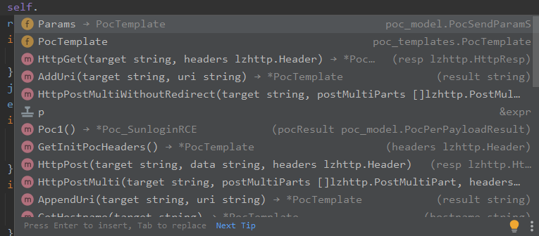

self.Params里有需要的各种请求参数。

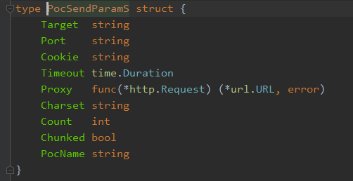

返回值是一个结构体，当漏洞存在Status为true

```go
type PocPerPayloadResult struct {
	Status   bool   // 漏洞是否存在
	Messages string // 漏洞信息
	Err      error  // 错误
}
```


### 漏洞信息注册

相较于exp来说，会简单许多，同样也是写在init()函数里

```go
func init() {
	registerMsg := poc_register.PocRegisterMsg{Msg: poc_model.PocMsg{
		Author:   "lz520520",
		Time:     "2022-02-16",
		Range:    "",
		ID:       "",
		Describe: "向日葵高端口RCE",
	},
		Proto: poc_model.PocHTTP,
	}
	poc_register.PocStructRegister(&Poc_SunloginRCE{}, registerMsg)
}
```

调用`poc_register.PocStructRegister`传入漏洞结构体的引用，以及注册信息即可。

注册信息目前只有量部分，漏洞基础信息，以及漏洞协议类型。

```go
// poc 信息栏
type PocMsg struct {
	Name     string // 漏洞名称，如果为空，则直接用结构体名
	Author   string // 作者
	Time     string // 发布时间
	Range    string // 影响范围
	ID       string // 漏洞编号
	Describe string // 漏洞描述
}
```

漏洞协议类型，大多是HTTP协议，其他协议主要是涉及端口，需要设置。

```go
var (
	PocHTTP PocProto = "HTTP"
	PocSMB  PocProto = "SMB"
	PocRDP  PocProto = "RDP"
)
```


### 最终效果


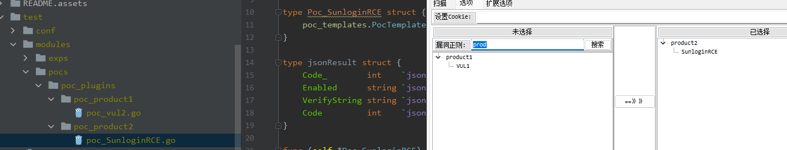

同样修改后可右键刷新，实现实时修改调整

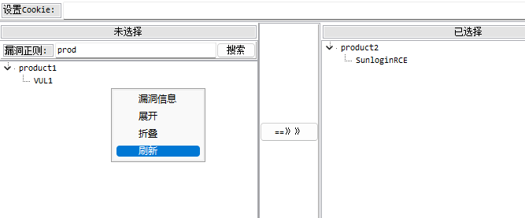


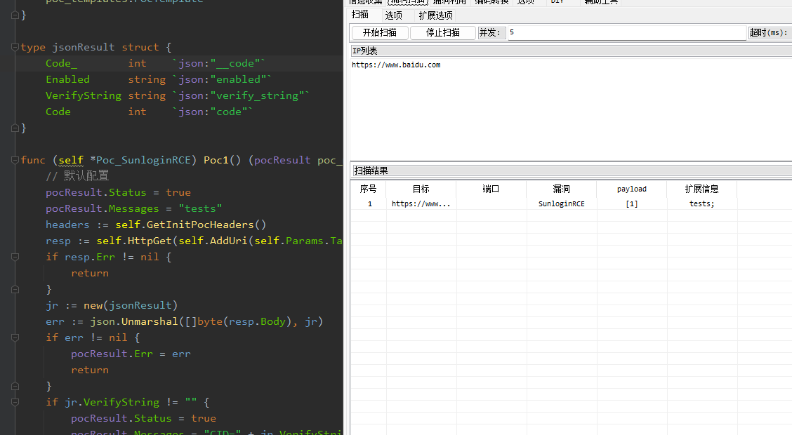


除此之外，在漏洞名上可右键-漏洞信息

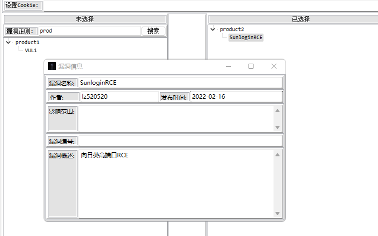

## 常用函数

这里不赘述了，和exp里的基本一样，直接看代码也行。


# 注意事项

1. 编写导入的库仅支持go自带库以及当前依赖库，第三方库不支持调用。
1. 代码文件中禁用声明`NewExp/NewPoc`函数