- [前言](#前言)
- [编写模板](#编写模板)
- [exp编写规范](#exp编写规范)
	- [exp文件创建](#exp文件创建)
	- [exp编写](#exp编写)
		- [导入依赖库](#导入依赖库)
		- [exp结构体](#exp结构体)
		- [编写exp举例](#编写exp举例)
		- [打印结果](#打印结果)
		- [漏洞信息注册](#漏洞信息注册)
			- [基础信息（必选）](#基础信息必选)
			- [子选项（可选）](#子选项可选)
			- [别名（可选）](#别名可选)
		- [最终效果](#最终效果)
	- [常用函数](#常用函数)
		- [HTTP方法](#http方法)
		- [消息打印](#消息打印)
		- [反序列化gadget辅助方法（新增）](#反序列化gadget辅助方法新增)
		- [yso利用链（新增）](#yso利用链新增)
		- [其他方法](#其他方法)
		- [goutils](#goutils)
- [poc编写规范](#poc编写规范)
	- [poc文件创建](#poc文件创建)
	- [poc编写](#poc编写)
		- [导入依赖库](#导入依赖库-1)
		- [poc结构体](#poc结构体)
		- [编写poc举例](#编写poc举例)
		- [漏洞信息注册](#漏洞信息注册-1)
		- [最终效果](#最终效果-1)
	- [常用函数](#常用函数-1)
- [编码转换模块调用（2022-12-11）](#编码转换模块调用2022-12-11)
- [注意事项](#注意事项)


# 前言

railgun工具插件开发依赖库，由于go是编译语言，所以要实现动态代码执行，需要提前解析依赖；

我单独分离了依赖库，可用于插件编写，请提前具备go语言的基础。

目前支持poc/exp的编写。


# 编写模板

https://github.com/lz520520/railgun-plugin-demo


# exp编写规范

## exp文件创建

根目录为`modules/exps/exp_plugins`，往下每个产品单独目录，目录名以`exp_`开头，每个目录下存在每个产品对应的各种漏洞exp的go文件，文件也是以`exp_`开头


## exp编写

### 导入依赖库

```go
import (
	"github.com/lz520520/railgunlib/pkg/templates/exp_templates"
	"github.com/lz520520/railgunlib/pkg/register/exp_register"
	"github.com/lz520520/railgunlib/pkg/templates/exp_model"
)
```


### exp结构体

声明一个exp结构体，结构体名严格按照`Exp_`开头，一定要首字母大写，结构体内只需要继承`exp_templates.ExpTemplate`即可

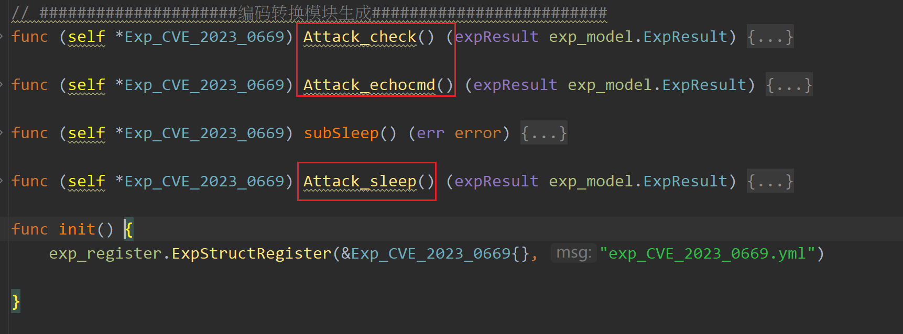

接着就是exp的利用方法，因为一个漏洞可能有多种利用方式，并且可能会有多种不同payload，所以会如上图形成各种利用方法。

均以`Attack_`开头，后面子方法名任意，一定要严格按照这个，否则无法解析。

方法签名如下

```go
func (self *exp) Attack_check() (expResult exp_model.ExpResult)
func (self *exp) Attack_echocmd() (expResult exp_model.ExpResult)
func (self *exp) Attack_sleep() (expResult exp_model.ExpResult)
```


### 编写exp举例


如一个S2-045，代码如下

```go
func (self *Exp_S2_045) Attack_cmd2() (expResult exp_model.ExpResult) {
    cmd := self.MustGetStringParam("cmd")

    // 构造payload
    headers := self.GetInitExpHeaders()
    shellPayload := `%{...}`
    shellPayload = strings.Replace(shellPayload, "lz520520", cmd, 1)
    headers["Content-Type"] = []string{shellPayload}

    // 发送请求
    httpresp := self.HttpGetWithoutRedirect(self.Params.BaseParam.Target, headers)
    if httpresp.Err != nil {
        expResult.Err = httpresp.Err.Error()
        return
    }
    expResult.Result = httpresp.Body
    return

}
```


由于结构体继承了`exp_templates.ExpTemplate`,可以使用父类的方法来处理（PS：这里只是引用了其他语言里基于对象的说法，go里没有对象）


self.Params里有需要的各种请求参数。

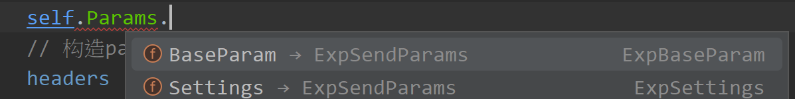

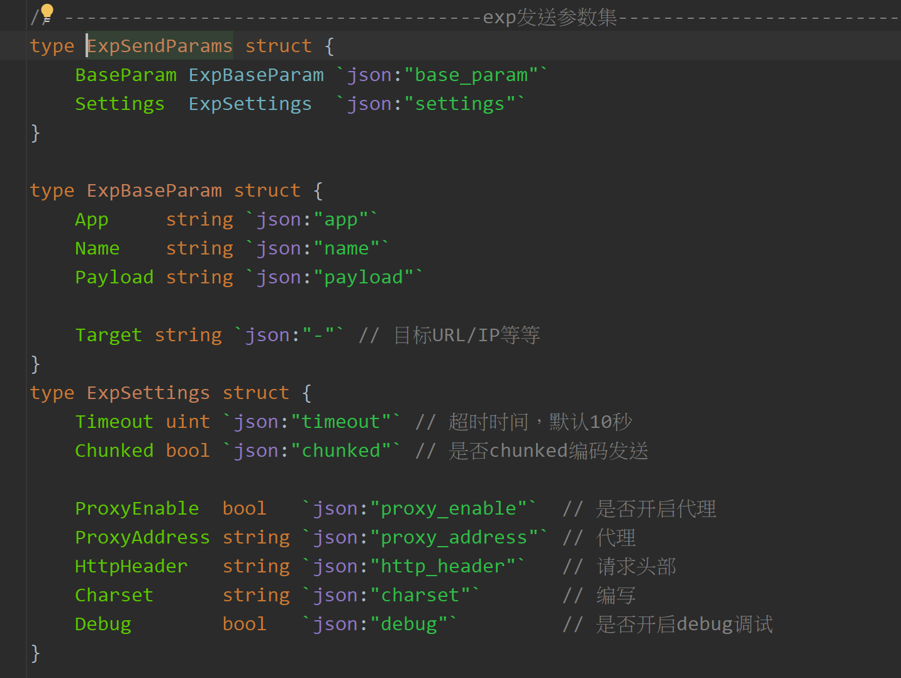


### 打印结果

打印结果有两种方法，将结果如下保存到相应结构体里即可

```
expResult.Result = httpresp.Body
```


或者调用logTpl.go里的方法打印也可。

```go
// 成功信息打印
func (self *ExpTemplate) EchoSuccessMsg(format string, a ...any) {}

// 告警信息打印
func (self *ExpTemplate) EchoWarnMsg(format string, a ...any) {}

// 普通信息打印
func (self *ExpTemplate) EchoInfoMsg(format string, a ...any) {}

// 错误信息打印
func (self *ExpTemplate) EchoErrMsg(format string, a ...any) {}

// 调试信息打印，开启DEBUG方可显示
func (self *ExpTemplate) EchoDebugMsg(format string, a ...any) {}

// 不换行信息打印
func (self *ExpTemplate) EchoInfoMsgWithoutReturn(format string, a ...any) {}

// 不换行错误信息打印
func (self *ExpTemplate) EchoErrMsgWithoutReturn(format string, a ...any) {}
```


### 漏洞信息注册

漏洞编写完后，除了具体的利用过程，还有一些漏洞信息需要注册的。（重构后，该部分优化为yml文件编写，并提供了UI进行生成，如下）

通过UI模块可以快速生成一个漏洞的基本信息，以及每个利用方法对应的参数

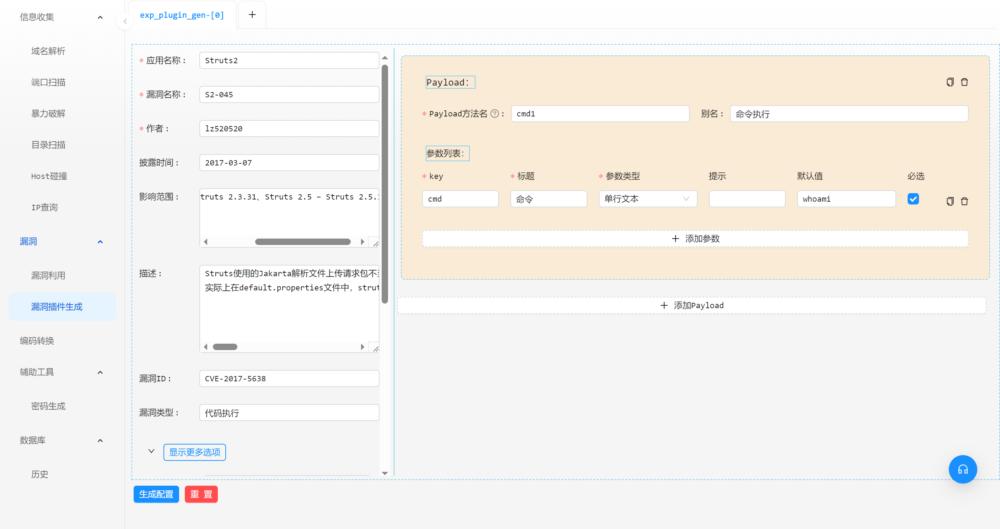

点击生成即可生成yml文件

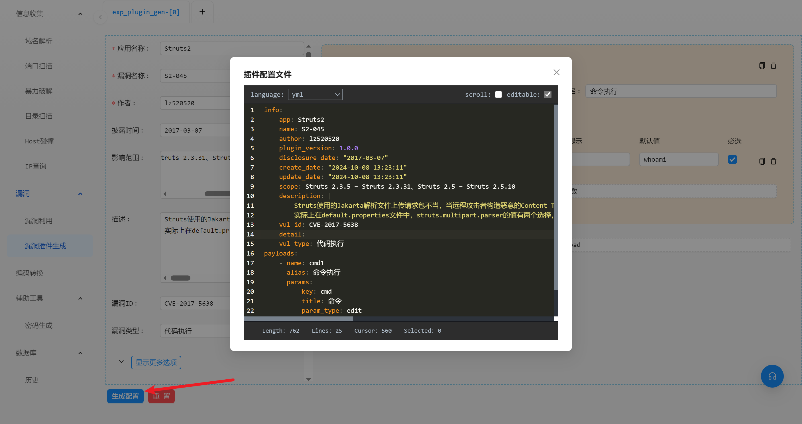

然后将yml文件放到与漏洞代码文件相同目录，在代码里指定yml文件名即可。

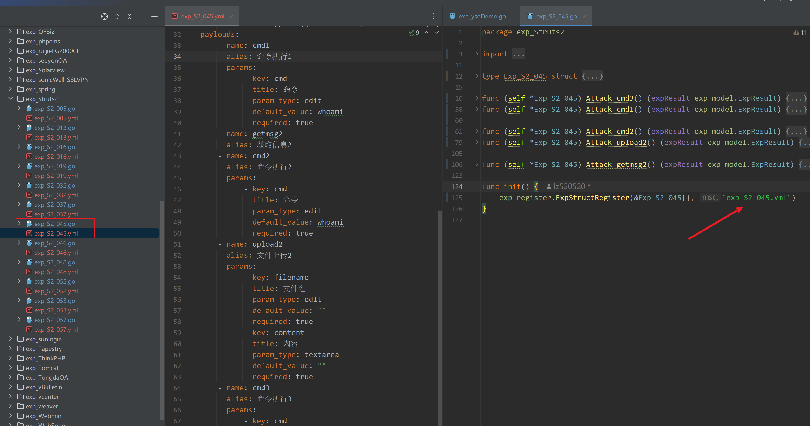


后续二次修改，直接修改yml文件即可，关于yml的所有参数结构体参考如下

```go
const (
    TypeNormalParam     = "normal"
    TypeFileParam       = "file"
    TypeProcessParam    = "process"
    TypeLabelParam      = "label"
    TypeTextAreaParam   = "textarea"
    TypeEditParam       = "edit"
    TypeCheckBoxParam   = "checkbox"
    TypeComboboxParam   = "combobox"
    TypeCodeEditorParam = "code"
)

type ExpInfo struct {
    App  string `json:"app" yaml:"app"`
    Name string `json:"name" yaml:"name"`

    Author string `json:"author" yaml:"author"`
    PluginVersion string `json:"plugin_version" yaml:"plugin_version"`

    DisclosureDate string `json:"disclosure_date" yaml:"disclosure_date"`
    CreateDate string `json:"create_date" yaml:"create_date,omitempty"`
    UpdateDate string `json:"update_date" yaml:"update_date,omitempty"`

    Scope string `json:"scope" yaml:"scope,omitempty"`

    Description string `json:"description" yaml:"description,omitempty"`

    VulID string `json:"vul_id" yaml:"vul_id,omitempty"`

    Detail string `json:"detail" yaml:"detail,omitempty"`

    Payload string `json:"payload" yaml:"payload,omitempty"`

    Repository string `json:"repository" yaml:"repository,omitempty"`

    Reference string `json:"reference" yaml:"reference,omitempty"`

    VulType   string `json:"vul_type" yaml:"vul_type,omitempty"`
}

type ExpUIPayload struct {
    Name   string       `json:"name" yaml:"name"`
    //Check  bool         `json:"check" yaml:"check"`
    Alias  string       `json:"alias" yaml:"alias,omitempty"`
    Params []ExpUIParam `json:"params" yaml:"params,omitempty"`
    Layout ExpUILayout  `json:"layout" yaml:"layout,omitempty"`
    Rule   ExpUIRule    `json:"rule" yaml:"rule,omitempty"`
}
type ExpUIParam struct {
    Key          string            `json:"key" yaml:"key"`
    Title        string            `json:"title" yaml:"title"`
    ParamType    string            `json:"param_type" yaml:"param_type"`
    Tips         string            `json:"tips" yaml:"tips,omitempty"`
    DefaultValue interface{}       `json:"default_value" yaml:"default_value,omitempty"`
    Required     bool              `json:"required" yaml:"required,omitempty"`
    AliasMap     map[string]string `json:"alias_map" yaml:"alias_map,omitempty"`
}
type ExpUILayout struct {
    LabelSpan   int `json:"label_span" yaml:"label_span,omitempty"`
    ResultWidth int `json:"result_width" yaml:"result_width,omitempty"`
}

type ExpUIRule struct {
    FilterCheckKey string                   `json:"filter_check_key" yaml:"filter_check_key,omitempty"` // 过滤检查的key
    FilterRules    map[string]ExpFilterRule `json:"filter_rules" yaml:"filter_rules,omitempty"`         // 过滤规则
    DynamicFormMap map[string]interface{}   `json:"dynamic_form_map" yaml:"dynamic_form_map,omitempty"`
}

type ExpFilterRule struct {
    Includes []string `json:"includes" yaml:"includes"`
    Excludes []string `json:"excludes" yaml:"excludes"`
}

type ExpRegisterMsg struct {
    Info     ExpInfo        `json:"info" yaml:"info"`
    Payloads []ExpUIPayload `json:"payloads" yaml:"payloads"`
}
```


### 最终效果

编写完成后，在利用模块点击`热更新`或`重新加载所有`即可更新插件。

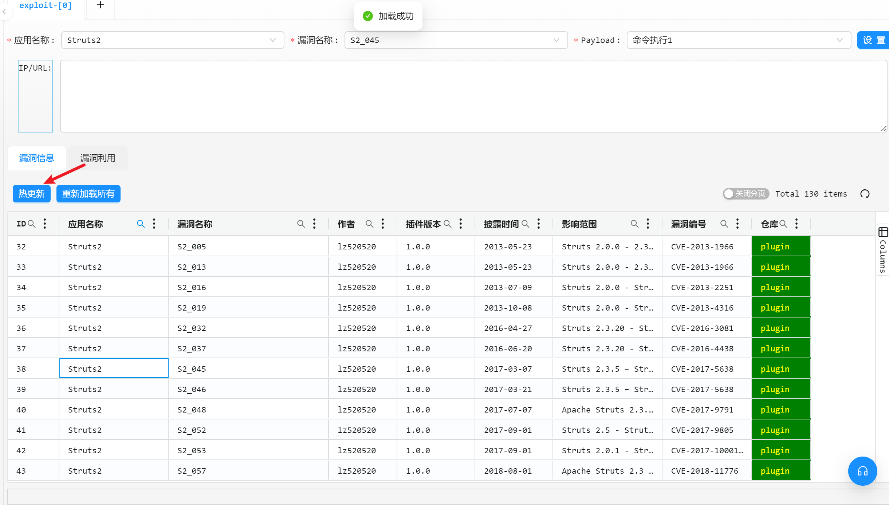

右键菜单可查看详情

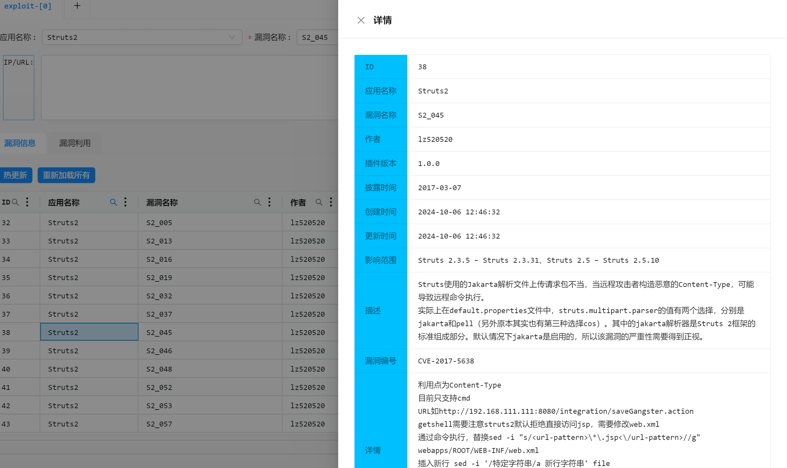

双击指定插件行，即可开始利用，选择不同payload会根据之前yml里配置的参数信息来动态渲染表单。

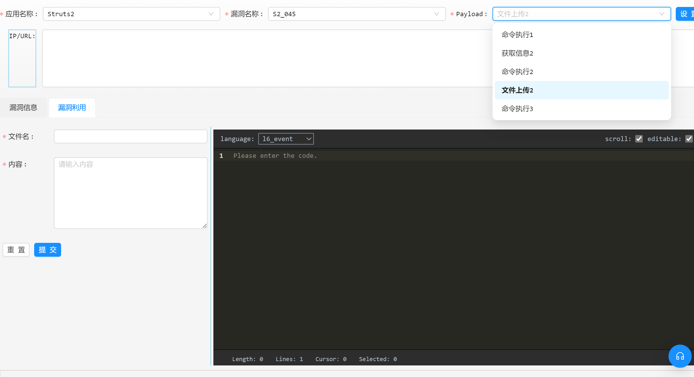


执行效果

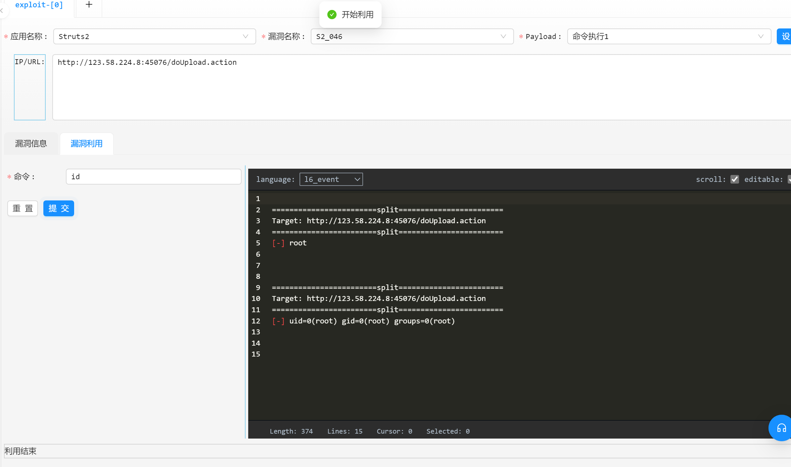


## 常用函数

### HTTP方法

编写方法内部通过接收者的self变量调用即可

```go
// -----------------------HTTP请求----------------------------------
func (self *ExpTemplate) HttpGetWithoutRedirect(target string, headers lzhttp.Header) (resp lzhttp.HttpResp) {
	return
}

func (self *ExpTemplate) HttpPostWithoutRedirect(target, data string, headers lzhttp.Header) (resp lzhttp.HttpResp) {
	return
}

func (self *ExpTemplate) HttpPutWithoutRedirect(target, data string, headers lzhttp.Header) (resp lzhttp.HttpResp) {
	return
}

func (self *ExpTemplate) HttpPostMultiWithoutRedirect(target string, postMultiParts []lzhttp.PostMultiPart, headers lzhttp.Header) (resp lzhttp.HttpResp) {
	return
}
```

注意事项

`HttpPostWithoutRedirect`: 如果header不设置`Content-Type`，默认为`application/x-www-form-urlencoded`


`HttpPostMultiWithoutRedirect`: 这个对应的是`multipart/form-data`，该方法需要传入一个PostMultiPart结构体，如下

```go
	multiParts := []lzhttp.PostMultiPart{
		{
			FieldName:   "filename",
			FileName:    "favicon.png",
			ContentType: "",
			Content:     []byte(content),
		},
	}
```


### 消息打印


```go
// 成功信息打印
func (self *ExpTemplate) EchoSuccessMsg(format string, a ...any) {}

// 告警信息打印
func (self *ExpTemplate) EchoWarnMsg(format string, a ...any) {}

// 普通信息打印
func (self *ExpTemplate) EchoInfoMsg(format string, a ...any) {}

// 错误信息打印
func (self *ExpTemplate) EchoErrMsg(format string, a ...any) {}

// 调试信息打印，开启DEBUG方可显示
func (self *ExpTemplate) EchoDebugMsg(format string, a ...any) {}

// 不换行信息打印
func (self *ExpTemplate) EchoInfoMsgWithoutReturn(format string, a ...any) {}

// 不换行错误信息打印
func (self *ExpTemplate) EchoErrMsgWithoutReturn(format string, a ...any) {}

```


### 反序列化gadget辅助方法（新增）

```go
// 添加EncodeEcho系列Gadget请求头
func (self *ExpTemplate) AddEncodeCmdHeader(srcheaders lzhttp.Header, cmd string) {
}


// 添加Echo系列Gadget请求头
func (self *ExpTemplate) AddPlainCmdHeader(srcheaders lzhttp.Header, cmd string) {
}

// 检查是否回显利用成功
func (self *ExpTemplate) CheckRespHeader(headers lzhttp.Header) bool {
	return false
}

// 解析EncodeEcho系列响应数据
func (self *ExpTemplate) ParserEncodeCmdResult(rawResult string) (parserResult string, err error) {
	return parserResult, nil
}

// 解析Echo系列响应数据
func (self *ExpTemplate) ParserPlainCmdResult(rawResult string) (parserResult string, err error) {
	return parserResult, nil
}

// 回调延迟利用函数，判断是否存在漏洞
func (self *ExpTemplate) CheckGagdetWithSleep(fun func() error, delay time.Duration) (status bool, err error) {
	return
}

```


### yso利用链（新增）

通过以下函数传入paylod名称以及参数来实现获取yso payload。

```go
func YsoserialPayloadGenerator(payloadType, cmd string) (payload []byte) {
	return
}
```

使用例子参考：[exp_ysoDemo.go](https://github.com/lz520520/railgun-plugin-demo/blob/master/modules/exps/exp_plugins/exp_product1/exp_ysoDemo.go)


目前支持的payload

推荐利用链：`CommonsCollectionsK1`、`CommonsCollectionsK2`、`CommonsBeanutilsNoCC1`、`CommonsBeanutilsNoCC2`以及它们的扩展，其余的利用链就`URLDNS`、`JRMPClient`和最新的`FindClassByDNS`。

| payload名称                           | 传参举例                       | 备注                     |
| ------------------------------------- | :----------------------------- | ------------------------ |
| URLDNS                                | xxx.dnslog.cn                  | dns解析                  |
| CommonsCollections1                   | calc                           | 无回显                   |
| CommonsCollections2                   | calc                           | 无回显                   |
| CommonsCollections3                   | calc                           | 无回显                   |
| CommonsCollections4                   | calc                           | 无回显                   |
| CommonsCollections5                   | calc                           | 无回显                   |
| CommonsCollections6                   | calc                           | 无回显                   |
| CommonsCollections10                  | calc                           | 无回显                   |
| Jdk7u21                               | calc                           | 无回显                   |
| Jdk8u20                               | calc                           | 无回显                   |
| JRMPClient                            | 192.168.1.1:1099               |                          |
|                                       |                                |                          |
| CommonsBeanutilsNoCC1TomcatEncodeEcho | 调用AddEncodeCmdHeader插入命令 | tomcat编码回显           |
| CommonsBeanutilsNoCC1SpringEncodeEcho | 调用AddEncodeCmdHeader插入命令 | spring编码回显           |
| CommonsBeanutilsNoCC1Sleep            | 空                             | sleep 10秒检测漏洞       |
| CommonsBeanutilsNoCC1SpringEcho       | 调用AddPlainCmdHeader插入命令  | spring明文回显           |
| CommonsBeanutilsNoCC1TomcatEcho       | 调用AddPlainCmdHeader插入命令  | tomcat明文回显           |
| CommonsBeanutilsNoCC1                 | calc                           | 无回显                   |
|                                       |                                |                          |
| CommonsBeanutilsNoCC2TomcatEncodeEcho | 调用AddEncodeCmdHeader插入命令 | tomcat编码回显           |
| CommonsBeanutilsNoCC2Sleep            | 空                             | sleep 10秒检测漏洞       |
| CommonsBeanutilsNoCC2SpringEncodeEcho | 调用AddEncodeCmdHeader插入命令 | spring编码回显           |
| CommonsBeanutilsNoCC2TomcatEcho       | 调用AddPlainCmdHeader插入命令  | tomcat明文回显           |
| CommonsBeanutilsNoCC2SpringEcho       | 调用AddPlainCmdHeader插入命令  | spring明文回显           |
| CommonsBeanutilsNoCC2                 | calc                           | 无回显                   |
|                                       |                                |                          |
| CommonsCollectionsK1TomcatEncodeEcho  | 调用AddEncodeCmdHeader插入命令 | tomcat编码回显           |
| CommonsCollectionsK1TomcatEcho        | 调用AddPlainCmdHeader插入命令  | tomcat明文回显           |
| CommonsCollectionsK1SpringEchoEcho    | 调用AddEncodeCmdHeader插入命令 | spring编码回显           |
| CommonsCollectionsK1SpringEcho        | 调用AddPlainCmdHeader插入命令  | tomcat明文回显           |
| CommonsCollectionsK1Sleep             | 空                             | sleep 10秒检测漏洞       |
| CommonsCollectionsK1                  | calc                           | 无回显                   |
|                                       |                                |                          |
| CommonsCollectionsK2TomcatEncodeEcho  | 调用AddEncodeCmdHeader插入命令 | tomcat编码回显           |
| CommonsCollectionsK2TomcatEcho        | 调用AddPlainCmdHeader插入命令  | tomcat明文回显           |
| CommonsCollectionsK2SpringEchoEcho    | 调用AddEncodeCmdHeader插入命令 | spring编码回显           |
| CommonsCollectionsK2SpringEcho        | 调用AddPlainCmdHeader插入命令  | tomcat明文回显           |
| CommonsCollectionsK2Sleep             | 空                             | sleep 10秒检测漏洞       |
| CommonsCollectionsK2                  | calc                           | 无回显                   |
|                                       |                                |                          |
| FindClassByDNS                        | xxx.dnslog.cn                  | 自动化检测多条利用链依赖 |
|                                       |                                |                          |
|                                       |                                |                          |
|                                       |                                |                          |
|                                       |                                |                          |
|                                       |                                |                          |
|                                       |                                |                          |
|                                       |                                |                          |
|                                       |                                |                          |


### 其他方法


```go
// 获取设置的http头部
func (self *ExpTemplate) GetInitExpHeaders() (headers lzhttp.Header) {
	return
}
```


### goutils


```go
// 获得当前程序所在的目录
func GetCurrentProcessFileDir() string {}

// 随机生成 MD5 HASH 值
func RandomMD5Hash() string {}

// 随机生成指定长度的字符串
func RandomHexString(size int) (ret string) {}

// 生成 `UUID` V4 字符串
func UUIDv4() string {}

// 获得当前用户的主目录
func UserHomeDir() string {}

// 是否正确的IP格式
func IsValidIP(ip string) bool {}

// 检测文件是否存在
func FileExists(filename string) bool {}

// 在时间范围内执行系统命令，并且将输出返回（stdout和stderr）
func ExecCmdWithTimeout(timeout time.Duration, arg ...string) ([]byte, error) {}


// 安全添加URI，如果uri已存在则不追加
func SafeAddUri(target, uri string, check string) (result string) {
	return
}
// 追加URL，基于当前目录
func AppendUri(target, uri string) (result string) {
	return
}
// 获取hostname，如192.168.1.1:88
func GetHostname(target string) (hostname string) {
	return
}

```


# 编码转换模块调用（2022-12-11）

在编写插件的时候，经常会遇到各种编码、加密算法的调用，每次都需要自己去查代码编写，railgun其实本身就有编码转换模块，已经支持了大多数常用的编码转换，索性就实现在插件里可以快速调用编码转换模块。

第一步：在编码转换模块调试好需要的编码转换逻辑，然后点击"生成代码"。

将命令进行`JavaRuntimeExec`编码并且进行URL二次编码，生成代码所示如下，把编码转换封装到一个函数里方便调用。

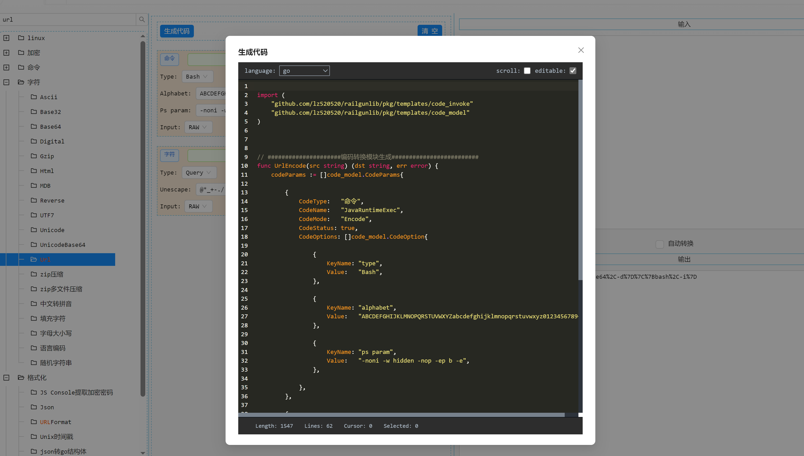

PS: 如果对参数选项需要自定义，只需要改动函数入参即可。


第二步：将自动生成的函数代码复制到插件代码中，然后调用就可以了，效果如下

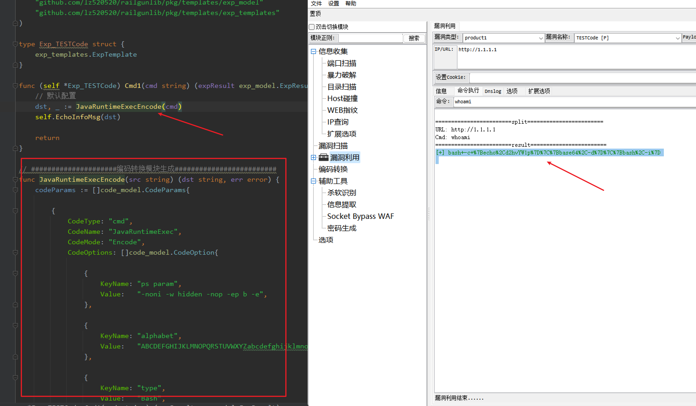


# 注意事项

1. 编写导入的库仅支持go自带库以及当前依赖库，第三方库不支持调用。
1. 代码文件中禁用声明`NewExp/NewPoc`函数